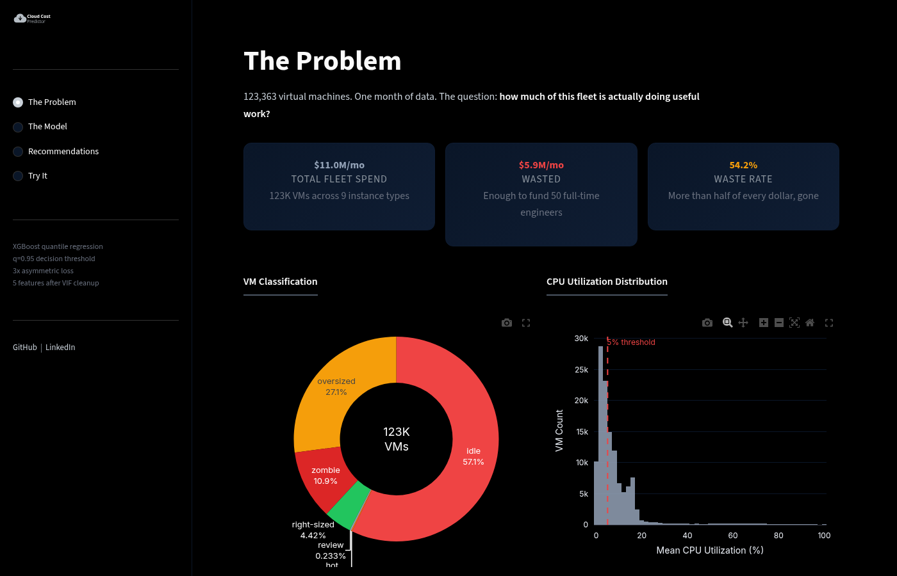
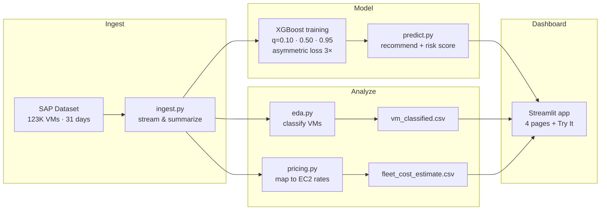

# cloud-cost-predictor

[](https://github.com/aroaxinping/cloud-cost-predictor/actions/workflows/ci.yml)


-yellow)

Predicting cloud infrastructure waste from 123K real VMs. XGBoost with asymmetric loss and 95% confidence intervals recommends which VMs to terminate, downsize, or keep.

## Problem

Companies waste 30-50% of their cloud spend on idle or oversized virtual machines. This project analyzes a real fleet of 123,000+ VMs, quantifies the waste, and builds a cost-aware predictive model to identify which machines can be safely downsized or terminated.

## Data

**SAP Cloud Infrastructure Dataset** ([Zenodo, CC BY 4.0](https://zenodo.org/records/13772668))
- 123,357 VMs monitored over 31 days (August 2024)
- CPU and memory utilization at daily granularity
- VM size classification (vCPU and RAM categories)

> Raw data is not included in this repo. Download `sap.zip` from the link above and place it in `data/raw/`.

## Key Findings

- Median CPU utilization: **5%**, half the fleet barely runs
- **95% of VMs** are candidates for right-sizing or termination
- Estimated waste: **$5.9M/month** on an $11M fleet (54%)

## Model

XGBoost quantile regression trained on 25 days of CPU time series to predict next-week utilization.

| Metric | Value |
|---|---|
| Algorithm | XGBoost quantile regression (q=0.10, 0.50, 0.95) |
| Median model loss | Asymmetric (3x penalty on underpredictions) |
| Features | 5 of 11 kept after VIF multicollinearity analysis |
| Median model Test MAE | 1.71% |
| 85% prediction interval coverage | 85.6% |
| Train-test gap | 0.04% (no overfitting) |
| Overfitting control | Early stopping, L2 reg, subsample 0.8 |
| Validation | 80/20 VM-level split (9,411 unseen VMs) |

### Cost-aware design

Underpredicting CPU usage is worse than overpredicting: terminating a VM that's actually needed causes downtime, while keeping an idle VM just wastes money. The model addresses this at three levels:

1. **Asymmetric loss**: the median model penalizes underpredictions 3x more than overpredictions
2. **95% confidence threshold**: recommendations use q=0.95 (not q=0.90), so only 5% chance of underestimating
3. **Risk levels**: each recommendation is tagged safe/moderate/risky based on margin to threshold

| Action | VMs | Savings potential |
|---|---|---|
| Terminate | 16,324 | $1,221/month |
| Downsize | 27,799 | $17,040/month |
| Review | 2,753 | $4,687/month |
| Keep | 177 | - |

## Dashboard

Interactive Streamlit app with four pages: fleet waste breakdown, model explainer (quantile bands, asymmetric loss curve, SHAP waterfall), recommendations explorer with AWS pricing transparency, and a "Try It" page for uploading your own VM data.



```bash
streamlit run app.py
```

## Explainability

SHAP TreeExplainer on the median model provides per-VM feature attribution. The notebook includes beeswarm and waterfall plots showing why specific VMs get their recommendations. The dashboard surfaces these waterfall plots on the Model page.

## Architecture



## Project Structure

```
app.py                <- Streamlit entry point (thin router)
dashboard/
  shared.py           <- colors, layouts, data loaders, CSS
  page_problem.py     <- fleet waste overview
  page_model.py       <- model explainer (quantiles, SHAP, loss)
  page_recommendations.py <- actions, savings, sensitivity
  page_try_it.py      <- upload your own data
data/
  raw/                <- source data (not tracked)
  clean/              <- processed datasets
  pricing/            <- EC2 on-demand rates (from AWS Bulk API)
notebooks/
  01_eda.ipynb
  02_cost_analysis.ipynb
  03_predictive_model.ipynb
src/
  ingest.py           <- stream SAP zip to per-VM summaries
  eda.py              <- classify VMs (memory-aware classification)
  pricing.py          <- map to EC2 pricing, estimate waste
  predict.py          <- load models, generate recommendations
  validate.py         <- data integrity checks
scripts/
  export_figures.py   <- generate publication-ready figures
  fetch_ec2_pricing.py <- refresh EC2 rates from AWS Bulk API
models/               <- trained XGBoost models (.json) + model card
tests/                <- 32 tests (predict, eda, pricing, validation, integration)
reports/
  figures/            <- generated plots
  coverage/           <- HTML coverage report
config.yaml           <- model hyperparameters and thresholds
pyproject.toml        <- dependencies and tool config (uv)
Dockerfile            <- containerized deployment with health check
Makefile              <- setup/train/predict/app targets (make help)
```

## Setup

Requires [uv](https://docs.astral.sh/uv/) (recommended) or pip.

```bash
# With uv (recommended)
uv sync --extra dev --extra notebooks

# Or with pip
pip install -e ".[dev,notebooks]"
```

## Usage

```bash
# Full pipeline
make all

# Or step by step:
make ingest     # Stream SAP dataset (requires sap.zip in data/raw/)
make train      # Train models via notebook execution
make predict    # Validate data + generate recommendations
make app        # Launch the Streamlit dashboard

# Pass a custom CSV
uv run python src/predict.py --input path/to/summary.csv --output output.csv

# Docker
make docker

# See all targets
make help
```

## A Note on the Data

The SAP dataset is from August 2024. This does not affect the analysis:

- **CPU predictions don't expire.** The model predicts utilization (% CPU), not prices. A VM running at 2% in 2024 would still be idle today. Usage patterns are hardware-agnostic and time-independent.
- **Cost estimates use real EC2 prices.** The $5.9M figure is computed from current AWS on-demand rates for us-east-1 (t3, m5, r5 families), not a made-up proxy. Prices for these established instance families have remained stable. Run `scripts/fetch_ec2_pricing.py` to refresh them from the AWS Bulk Pricing API.
- **The value is methodological.** The dataset comes from a peer-reviewed academic source (SAP, CC BY 4.0). The contribution is the pipeline (asymmetric loss, quantile thresholds, per-VM risk scoring), not the specific dollar amounts.

## Limitations

- **No temporal trend in inference.** The `trend` feature (slope of daily CPU) is available during training but not in `predict.py`, which lacks the raw time series. It defaults to zero, slightly reducing prediction quality for VMs with strong upward/downward trends.
- **Memory thresholds are heuristic.** The classification checks memory to prevent terminating memory-bound VMs (>80% mem = right-sized), but the predict model itself does not use memory features. A future version could add memory quantile predictions.
- **Static dataset, no retraining loop.** The model is trained once on 31 days of data. A production system would need periodic retraining to capture seasonal patterns and fleet changes.
- **Compute-only cost model.** Savings estimates use real EC2 on-demand prices (refreshable via `scripts/fetch_ec2_pricing.py`) but do not account for storage, networking, reserved instances, or volume discounts.

## Next Steps

- **Memory quantile predictions:** train a parallel memory model so recommendations consider both CPU and memory utilization forecasts
- **SHAP-based recommendation explanations:** surface the top-3 features driving each VM's recommendation in the dashboard and CSV output
- **Anomaly detection layer:** flag VMs with recent CPU spikes before recommending termination, even if their monthly average is low
- **Reserved instance / Savings Plans modeling:** compare on-demand waste against what RI/SP commitments would cost, since many "idle" VMs may already be covered by reservations

## License

Analysis code: MIT. Dataset: CC BY 4.0 (SAP).
