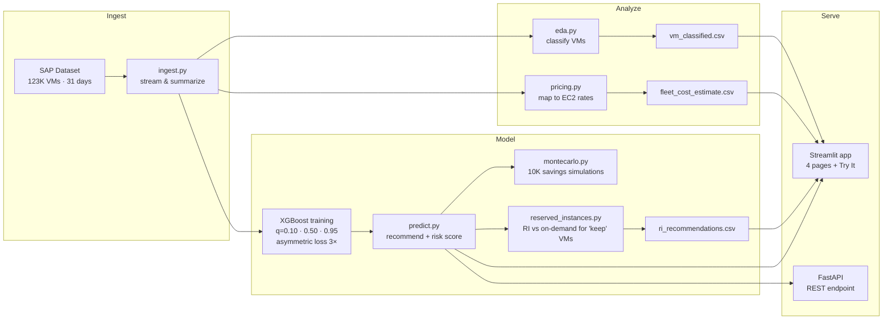

# cloud-cost-predictor

[](https://github.com/aroaxinping/cloud-cost-predictor/actions/workflows/ci.yml)


-yellow)

Predicting cloud infrastructure waste from 123K real VMs. XGBoost with asymmetric loss and 95% confidence intervals recommends which VMs to terminate, downsize, or keep.

## Problem

Companies waste 30-50% of their cloud spend on idle or oversized virtual machines. This project analyzes a real fleet of 123,000+ VMs, quantifies the waste, and builds a cost-aware predictive model to identify which machines can be safely downsized or terminated.

## Data

**SAP Cloud Infrastructure Dataset** ([Zenodo, CC BY 4.0](https://zenodo.org/records/13772668))
- 123,357 VMs monitored over 31 days (August 2024)
- CPU and memory utilization at daily granularity
- VM size classification (vCPU and RAM categories)

> Raw data is not included in this repo. Download `sap.zip` from the link above and place it in `data/raw/`.

## Key Findings

- Median CPU utilization: **5%**, half the fleet barely runs
- **95% of VMs** are candidates for right-sizing or termination
- Estimated waste: **$5.9M/month** on an $11M fleet (54%)

## Model

XGBoost quantile regression trained on 25 days of CPU time series to predict next-week utilization.

| Metric | Value |
|---|---|
| Algorithm | XGBoost quantile regression (q=0.10, 0.50, 0.95) |
| Median model loss | Asymmetric (3x penalty on underpredictions) |
| Features | 5 of 11 kept after VIF multicollinearity analysis |
| Median model Test MAE | 1.71% |
| 85% prediction interval coverage | 85.6% |
| Train-test gap | 0.04% (no overfitting) |
| Overfitting control | Early stopping, L2 reg, subsample 0.8 |
| Validation | 80/20 VM-level split (9,411 unseen VMs) |
| Cross-validation | 5-fold TimeSeriesSplit, stable MAE across folds |

### Cost-aware design

Underpredicting CPU usage is worse than overpredicting: terminating a VM that's actually needed causes downtime, while keeping an idle VM just wastes money. The model addresses this at three levels:

1. **Asymmetric loss**: the median model penalizes underpredictions 3x more than overpredictions
2. **95% confidence threshold**: recommendations use q=0.95, so only 5% chance of underestimating
3. **Risk levels**: each recommendation is tagged safe/moderate/risky based on margin to threshold

| Action | VMs | Savings potential |
|---|---|---|
| Terminate | 16,324 | $1,221/month |
| Downsize | 27,799 | $17,040/month |
| Review | 2,753 | $4,687/month |
| Keep | 177 | n/a |

### Monte Carlo savings simulation

Point estimates hide uncertainty. The Monte Carlo module (`src/montecarlo.py`) runs 10K simulations, sampling future CPU from triangular distributions bounded by quantile predictions. This produces a savings distribution with confidence intervals instead of a single number, making the business case more honest.

### Feature importance

Two complementary approaches validate which features matter:

- **Gain-based importance** (XGBoost internal): how much each feature reduces training loss across splits
- **Permutation importance** (model-agnostic): shuffle one feature on the test set, measure MAE degradation

Both confirm p50 (median CPU) as the dominant predictor, with std and cv contributing meaningful signal for volatile VMs.

## Drift detection

Notebook 04 monitors whether feature distributions have shifted since training using:

- **PSI (Population Stability Index)**: bins features and compares proportions between reference and production data. PSI < 0.1 is safe, 0.1-0.25 warrants investigation, > 0.25 triggers retraining.
- **KS test (Kolmogorov-Smirnov)**: non-parametric two-sample test per feature. Low p-value = significant distributional shift.

In production, run this on every new data batch before trusting model predictions.

## VM clustering

Notebook 05 groups VMs by usage behavior using K-Means on the 5 model features. Elbow + silhouette analysis selects optimal k. Clusters are auto-labeled as archetypes (zombie, idle, bursty, workhorse, moderate) and cross-referenced with the rule-based classification from `eda.py` to spot divergences.

This is useful for fleet operations: instead of acting on 123K individual recommendations, teams can reason about a handful of behavioral groups.

## Reserved Instances

The 177 VMs tagged `keep` (see the actions table above) are the only ones not already slated for termination/downsizing/review — the only workloads stable enough to commit capacity to. `src/reserved_instances.py` prices them against real 1yr/3yr EC2 Reserved Instance rates (standard offering class) pulled from the AWS Bulk Pricing API, the same public endpoint `fetch_ec2_pricing.py` already uses for on-demand prices.

| Term | Payment option | $/VM/month | Savings vs on-demand | Breakeven utilization |
|---|---|---|---|---|
| 3yr | All Upfront | $33.47 | 62.4% | 37.6% |
| 3yr | Partial Upfront | $35.56 | 60.0% | 40.0% |
| 3yr | No Upfront | $38.35 | 56.9% | 43.1% |
| 1yr | All Upfront | $52.26 | 41.3% | 58.7% |
| 1yr | Partial Upfront | $53.39 | 40.0% | 60.0% |
| 1yr | No Upfront | $55.92 | 37.2% | 62.8% |

Against a fleet-weighted on-demand baseline of **$89.01/VM/month**, the cheapest commitment (3yr, All Upfront) cuts that to **$33.47/VM/month** — **$9,831/month** (~$117,967/year) across the 177 `keep` VMs if all of them were reserved. Breakeven utilization is the minimum fraction of on-demand hours a VM must actually run for the reservation to beat staying on-demand — 37.6% for the cheapest option, meaning it pays off well before "always on."

Run it with `make ri` (writes `data/clean/ri_recommendations.csv`); refresh the underlying rates with `python scripts/fetch_ri_pricing.py`.

**Two things to read before trusting these numbers:**

- **No per-VM instance type.** The SAP dataset only has aggregate `(ram_category, vcpu_category)` counts (`data/clean/vm_size_distribution.csv`), not a real instance type per VM — the same gap `pricing.py`'s fleet cost estimate already works around. So every `keep` VM is priced with the same fleet-weighted average across the project's t3/m5/r5 mix; only `instance` and `actual_cpu` in `ri_recommendations.csv` are VM-specific. This is stated in the module docstring rather than pretending to know each VM's real size.
- **Savings Plans are not computed.** AWS does not publish Savings Plans rates on the public Bulk Pricing API this project uses for on-demand and RI prices — that needs the authenticated `savingsplans:DescribeRates` API (AWS account + credentials this pipeline doesn't have). Rather than guess a discount, `ri_recommendations.csv`'s `savings_plan` column says so explicitly. Whoever runs this with AWS credentials can extend `src/reserved_instances.py` to call that API and fill it in for real.

## REST API

FastAPI endpoint (`src/api.py`) wraps the trained models for integration with infrastructure tooling.

```bash
# Start the server
make api

# Score a batch of VMs
curl -X POST http://localhost:8000/predict \
  -H "Content-Type: application/json" \
  -d '{"vms": [{"instance": "vm-1", "cpu_std": 2.0, "cpu_min": 1.0, "cpu_median": 3.0, "cv": 0.5}]}'
```

Returns quantile predictions (low/mid/high), action, risk level, and estimated monthly savings per VM.

## Dashboard

Interactive Streamlit app with five pages: fleet waste breakdown, model explainer (quantile bands, asymmetric loss curve, SHAP waterfall), recommendations explorer with AWS pricing transparency, a Reserved Instances page comparing on-demand vs RI costs for "keep" VMs, and a "Try It" page for uploading your own VM data.

```bash
make app
```

## Explainability

SHAP TreeExplainer on the median model provides per-VM feature attribution. The notebook includes beeswarm and waterfall plots showing why specific VMs get their recommendations. The dashboard surfaces these waterfall plots on the Model page.

## Architecture



## Project Structure

```
app.py                <- Streamlit entry point (thin router)
config.yaml           <- single source of truth for thresholds and model params
dashboard/
  shared.py           <- colors, layouts, data loaders, CSS
  page_problem.py     <- fleet waste overview
  page_model.py       <- model explainer (quantiles, SHAP, loss)
  page_recommendations.py <- actions, savings, sensitivity
  page_reserved_instances.py <- on-demand vs RI costs for "keep" VMs
  page_try_it.py      <- upload your own data
data/
  raw/                <- source data (not tracked)
  clean/              <- processed datasets
  pricing/            <- EC2 on-demand + Reserved Instance rates (from AWS Bulk API)
notebooks/
  01_eda.ipynb        <- exploratory data analysis
  02_cost_analysis.ipynb <- fleet cost estimation
  03_predictive_model.ipynb <- model training, SHAP, CV, Monte Carlo
  04_drift_detection.ipynb  <- PSI + KS tests for feature drift
  05_vm_clustering.ipynb    <- K-Means usage archetypes
src/
  ingest.py           <- stream SAP zip to per-VM summaries
  eda.py              <- classify VMs (config-driven, memory-aware)
  pricing.py          <- map to EC2 pricing, estimate waste
  predict.py          <- load models, generate recommendations
  reserved_instances.py <- price "keep" VMs against RI commitments
  validate.py         <- data integrity checks
  montecarlo.py       <- Monte Carlo savings simulation
  api.py              <- FastAPI prediction endpoint
scripts/
  export_figures.py   <- generate publication-ready figures
  fetch_ec2_pricing.py <- refresh EC2 on-demand rates from AWS Bulk API
  fetch_ri_pricing.py <- refresh EC2 Reserved Instance rates from AWS Bulk API
models/               <- trained XGBoost models (.json) + model card
tests/                <- 70 tests (predict, eda, pricing, RI, validation, API, Monte Carlo)
reports/
  figures/            <- generated plots
  coverage/           <- HTML coverage report
pyproject.toml        <- dependencies and tool config (uv)
Dockerfile            <- containerized deployment with health check
Makefile              <- setup/train/predict/app/api targets (make help)
```

## Setup

Requires [uv](https://docs.astral.sh/uv/) (recommended) or pip.

```bash
# With uv (recommended)
uv sync --extra dev --extra notebooks

# Or with pip
pip install -e ".[dev,notebooks]"
```

## Usage

```bash
# Full pipeline
make all

# Or step by step:
make ingest     # Stream SAP dataset (requires sap.zip in data/raw/)
make eda        # Classify VMs
make pricing    # Estimate fleet costs from EC2 rates
make train      # Train models via notebook execution
make predict    # Validate data + generate recommendations
make ri         # Compare on-demand vs Reserved Instance costs for "keep" VMs
make app        # Launch the Streamlit dashboard
make api        # Launch the FastAPI prediction server

# Pass a custom CSV
uv run python src/predict.py --input path/to/summary.csv --output output.csv

# Docker
make docker

# See all targets
make help
```

## A Note on the Data

The SAP dataset is from August 2024. This does not affect the analysis:

- **CPU predictions don't expire.** The model predicts utilization (% CPU), not prices. A VM running at 2% in 2024 would still be idle today. Usage patterns are hardware-agnostic and time-independent.
- **Cost estimates use real EC2 prices.** The $5.9M figure is computed from current AWS on-demand rates for us-east-1 (t3, m5, r5 families). Run `scripts/fetch_ec2_pricing.py` to refresh them from the AWS Bulk Pricing API.
- **The value is methodological.** The dataset comes from a peer-reviewed academic source (SAP, CC BY 4.0). The contribution is the pipeline (asymmetric loss, quantile thresholds, per-VM risk scoring), not the specific dollar amounts.

## Limitations

- **No temporal trend in inference.** The `trend` feature is available during training but not in `predict.py`, which lacks the raw time series. It defaults to zero, slightly reducing prediction quality for VMs with strong upward/downward trends.
- **Memory thresholds are heuristic.** The classification checks memory to prevent terminating memory-bound VMs (>80% mem = right-sized), but the prediction model does not use memory features.
- **Static dataset, no retraining loop.** The model is trained once on 31 days of data. A production system would need periodic retraining. The drift detection notebook (04) provides the monitoring framework for this.
- **Compute-only cost model.** Savings estimates use real EC2 on-demand and Reserved Instance prices but do not account for storage, networking, or volume discounts.
- **Reserved Instance pricing is fleet-averaged, not per-VM.** There's no per-VM instance type in the SAP dataset, so `ri_recommendations.csv` prices every `keep` VM with the same fleet-weighted average instead of a real per-VM type (see "Reserved Instances" above). Savings Plans rates aren't computed at all — the public pricing API doesn't publish them.

## Next Steps

- **Memory quantile predictions:** train a parallel memory model so recommendations consider both CPU and memory utilization forecasts
- **Anomaly detection layer:** flag VMs with recent CPU spikes before recommending termination, even if their monthly average is low
- **Real Savings Plans rates:** `src/reserved_instances.py` already models Reserved Instances against real AWS prices; wiring up the authenticated `savingsplans:DescribeRates` API would let it compare RI against Savings Plans instead of leaving that column blank
- **Conformal prediction:** replace quantile regression intervals with distribution-free conformal prediction sets for guaranteed coverage

## License

Analysis code: MIT. Dataset: CC BY 4.0 (SAP).
